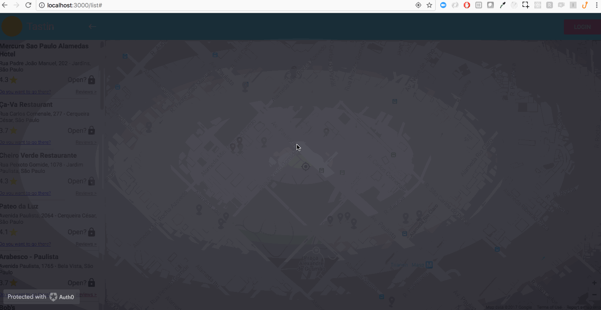

# Tastin

[![travis][travis-image]][travis-url]

### Overview

App to find restaurants around the user.

### Tools
  - Atomic design
  - Create React App
  - React
  - Redux
  - Semistandard
  - Auth0
  - google-map-react
  - material-ui
  - enzyme
  - react-devtools
  - tests
  - test coverage report
  
### Commands
  #### Installation
    - cp .env.example .env (fill with the right variables)
    - yarn
  #### Development
    - yarn start
    - NOTE: to access it locally http://localhost:3000
  #### Testing
    - yarn test
    - yarn coverage
  #### Deploy
    - yarn deploy
    
  #### Things to be improved
    - Better design
    - Tests
    - Directions to be opened in other instance of google maps
    - git hooks
    - Authentication backend
    - scroll when selecting place
    - filtering, radius
    - Loaders when data fetching
  
### Example

[travis-image]: https://img.shields.io/travis/Flet/semistandard.svg?style=flat-square
[travis-url]: https://travis-ci.org/marcelorl/tastin-front
